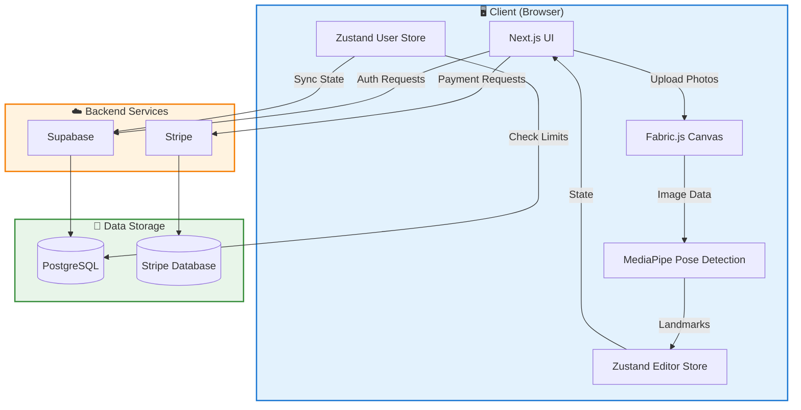
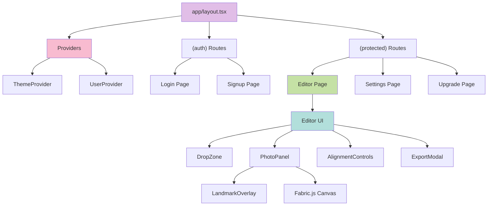
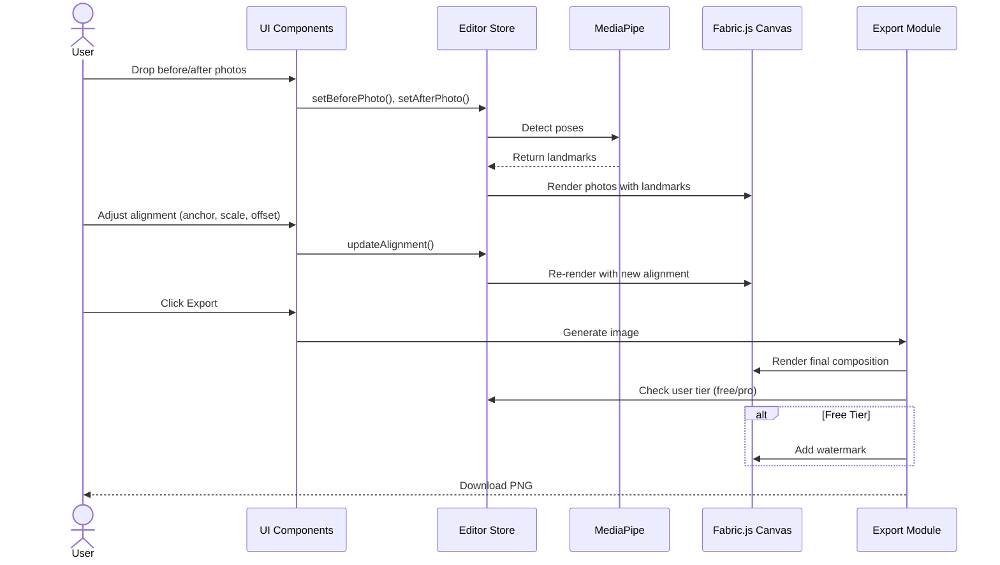
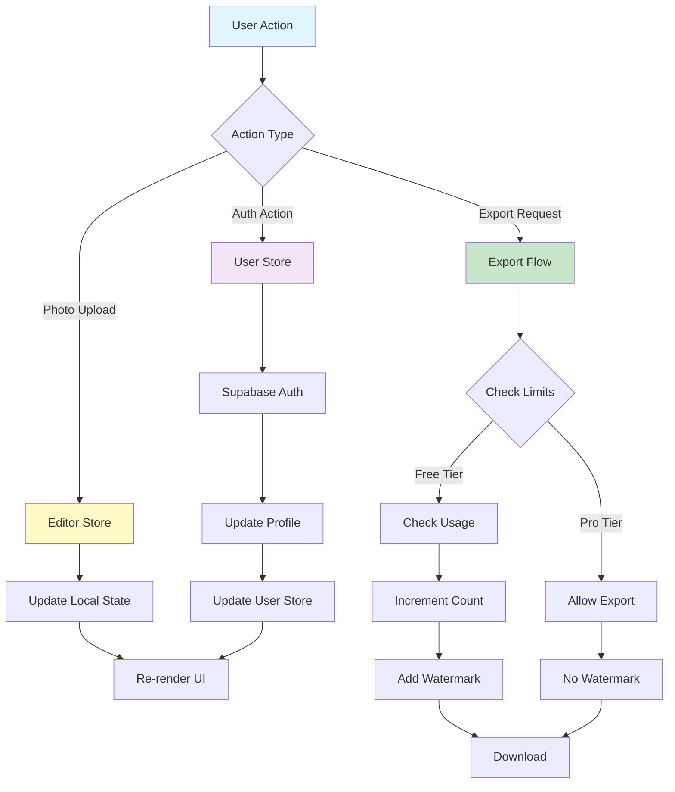
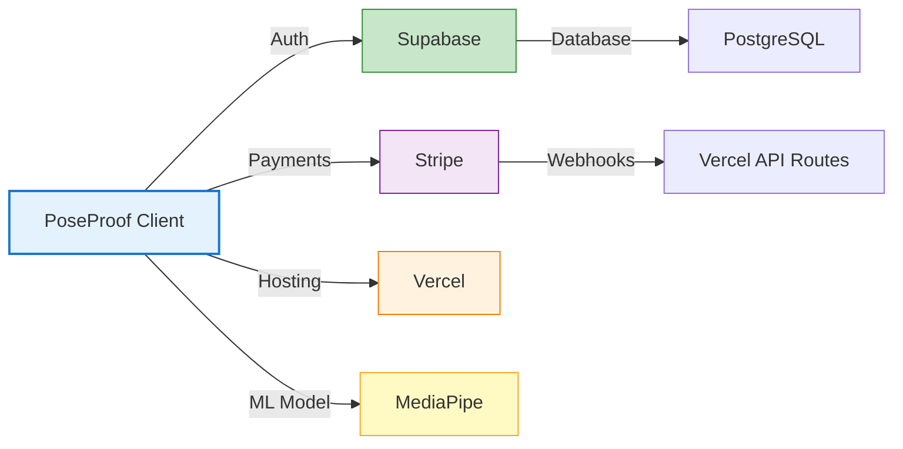
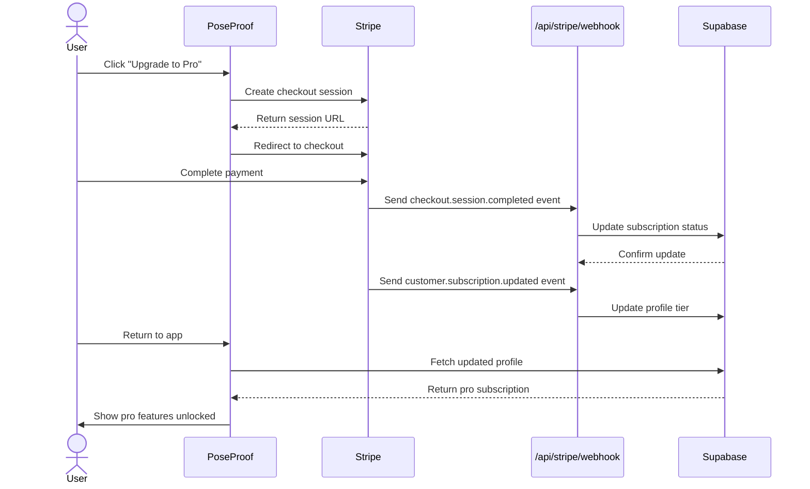
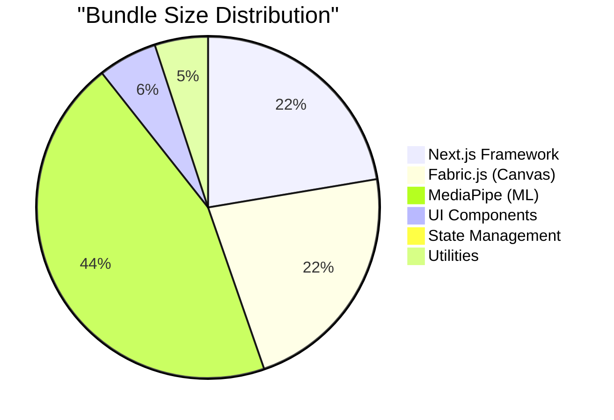
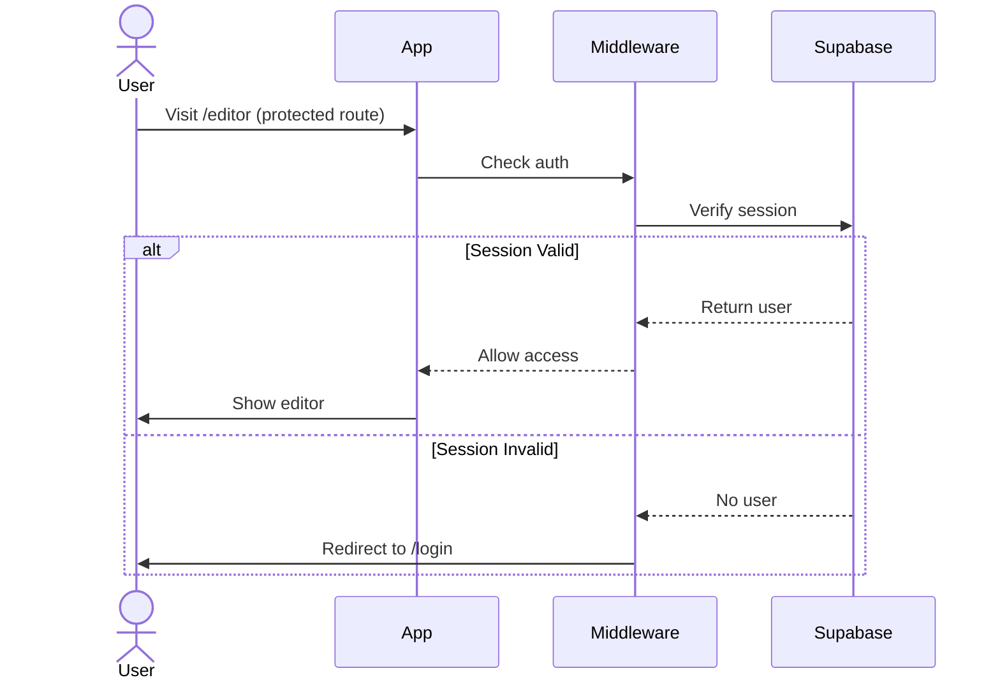

# Architecture Overview

**Version:** 1.0.0
**Last Updated:** 2025-12-22
**Scope:** System architecture, component hierarchy, data flow, and design decisions

## Table of Contents

1. [High-Level Architecture](#high-level-architecture)
2. [Client-Side Processing](#client-side-processing)
3. [Component Hierarchy](#component-hierarchy)
4. [Data Flow](#data-flow)
5. [State Management](#state-management)
6. [Key Design Decisions](#key-design-decisions)
7. [Integration Points](#integration-points)

---

## High-Level Architecture

PoseProof follows a **privacy-first, client-side processing** architecture where all photo manipulation happens in the browser. The backend only handles authentication, subscription management, and usage tracking.



### Architecture Principles

1. **Privacy First** - Photos never leave the browser
2. **Client-Side Processing** - All image manipulation happens locally
3. **Progressive Enhancement** - Works offline for core features
4. **Serverless Backend** - Minimal server-side logic
5. **Scalable State** - Zustand for predictable state management

---

## Client-Side Processing

### Why Client-Side?

**Privacy:** Users' fitness photos are sensitive. By processing client-side, we eliminate privacy concerns and build trust.

**Performance:** No upload/download latency. Instant feedback on alignment changes.

**Cost:** Reduced server costs. No need for expensive image processing infrastructure.

### Processing Pipeline

```mermaid
flowchart LR
    A[Photo Upload] --> B[HEIC Conversion]
    B --> C[Image Scaling]
    C --> D[Canvas Rendering]
    D --> E[MediaPipe Detection]
    E --> F[Landmark Extraction]
    F --> G[Alignment Calculation]
    G --> H[Visual Preview]
    H --> I[Export Generation]

    style A fill:#bbdefb
    style E fill:#fff9c4
    style I fill:#c8e6c9
```



**Steps:**

1. **Upload** - User drags photos into DropZone
2. **Conversion** - HEIC images converted to JPEG (browser-heic-to-jpeg)
3. **Scaling** - Images scaled to max 2000px (performance optimization)
4. **Rendering** - Photos loaded into Fabric.js canvas
5. **Detection** - MediaPipe analyzes poses and extracts 33 body landmarks
6. **Alignment** - Calculate offset/scale based on anchor points (shoulders, hips, face)
7. **Preview** - Real-time side-by-side comparison
8. **Export** - Generate high-quality PNG (with watermark if free tier)

---

## Component Hierarchy

### Application Structure



### Component Categories

| Category          | Components                                                        | Purpose                   |
| ----------------- | ----------------------------------------------------------------- | ------------------------- |
| **Layout**        | `app/layout.tsx`, `app/(auth)/layout.tsx`                         | App structure and routing |
| **Providers**     | `ThemeProvider`, `UserProvider`                                   | Global state and context  |
| **Features**      | `DropZone`, `PhotoPanel`, `AlignmentControls`, `ExportModal`      | Editor functionality      |
| **UI Primitives** | `Button`, `Card`, `Modal`, `Slider`, `Toggle`, `SegmentedControl` | Reusable components       |
| **Overlays**      | `LandmarkOverlay`, `Watermark`                                    | Visual feedback layers    |

---

## Data Flow

### Photo Upload to Export Flow



### State Synchronization Flow



---

## State Management

### Zustand Stores

PoseProof uses two primary Zustand stores for state management:

#### 1. Editor Store (`stores/editor-store.ts`)

Manages all editor-related state.

```typescript
interface EditorState {
  // Photos with landmarks
  beforePhoto: Photo | null;
  afterPhoto: Photo | null;

  // Alignment settings
  alignment: AlignmentSettings; // anchor, scale, offsetX, offsetY

  // UI toggles
  showLandmarks: boolean;
  showGrid: boolean;
  linkedZoom: boolean;

  // Status
  isDetecting: boolean;
  error: string | null;

  // Actions
  setBeforePhoto();
  setAfterPhoto();
  setBeforeLandmarks();
  setAfterLandmarks();
  updateAlignment();
  toggleLandmarks();
  toggleGrid();
  toggleLinkedZoom();
  reset();
}
```

**Usage:**

```typescript
const { beforePhoto, alignment, updateAlignment } = useEditorStore();
```

#### 2. User Store (`stores/user-store.ts`)

Manages user authentication and subscription state.

```typescript
interface UserState {
  // User data
  user: User | null;
  profile: Profile | null;
  subscription: Subscription | null;
  usage: Usage | null;

  // Computed getters
  isPro(): boolean;
  canExport(): boolean;
  exportsRemaining(): number;
  exportLimit(): number;

  // Actions
  initialize();
  fetchProfile();
  fetchSubscription();
  fetchUsage();
  incrementUsage();
  signOut();
}
```

**Usage:**

```typescript
const { isPro, canExport, exportsRemaining, incrementUsage } = useUserStore();
```

### State Flow Patterns

**✅ CORRECT: Centralized state updates**

```typescript
// Update editor state through store actions
const { updateAlignment } = useEditorStore();
updateAlignment({ scale: 1.2, offsetX: 50 });
```

**❌ WRONG: Direct state mutation**

```typescript
// Don't mutate state directly
editorStore.alignment.scale = 1.2; // This won't trigger re-renders
```

---

## Key Design Decisions

### 1. Client-Side Pose Detection

**Decision:** Use MediaPipe for client-side pose detection instead of server-side ML models.

**Rationale:**

- Privacy: Photos never leave the browser
- Performance: No network latency
- Cost: No server GPU costs
- Offline capability: Works without internet after initial load

**Trade-offs:**

- Browser compatibility required
- Initial load time for MediaPipe model
- Limited to MediaPipe's pose model (33 landmarks)

### 2. Fabric.js for Canvas Management

**Decision:** Use Fabric.js instead of native Canvas API or other libraries.

**Rationale:**

- Object-oriented API (easier to manage multiple photos)
- Built-in transformations (scale, rotate, translate)
- Event handling for interactions
- Export capabilities

**Trade-offs:**

- Larger bundle size (~200KB)
- Learning curve for Fabric.js API
- Some performance overhead vs raw Canvas

### 3. Zustand for State Management

**Decision:** Use Zustand instead of Redux, Context API, or Jotai.

**Rationale:**

- Minimal boilerplate (no providers, actions, reducers)
- TypeScript-first design
- Devtools integration
- Small bundle size (~1KB)
- No context provider hell

**Trade-offs:**

- Less ecosystem (compared to Redux)
- No built-in middleware (though easily added)

### 4. Supabase for Backend

**Decision:** Use Supabase instead of custom backend or Firebase.

**Rationale:**

- PostgreSQL (powerful relational database)
- Row Level Security (fine-grained access control)
- Real-time subscriptions (future feature potential)
- Type generation from schema
- Generous free tier

**Trade-offs:**

- Vendor lock-in (though open-source)
- Learning curve for RLS policies
- Cold start latency on free tier

### 5. Next.js App Router

**Decision:** Use Next.js 15 App Router instead of Pages Router or other frameworks.

**Rationale:**

- Server Components for better performance
- Built-in API routes
- File-based routing
- Middleware for auth
- Vercel deployment optimization

**Trade-offs:**

- Steeper learning curve (vs Pages Router)
- Some ecosystem libraries not yet compatible
- Breaking changes between versions

---

## Integration Points

### External Services



### API Routes

| Route                  | Purpose                        | Integration       |
| ---------------------- | ------------------------------ | ----------------- |
| `/api/auth/callback`   | Supabase auth callback         | Supabase Auth     |
| `/api/stripe/checkout` | Create Stripe checkout session | Stripe Checkout   |
| `/api/stripe/webhook`  | Handle Stripe events           | Stripe Webhooks   |
| `/api/usage/track`     | Track export usage             | Supabase Database |
| `/api/usage/current`   | Get current month usage        | Supabase RPC      |

### Webhook Flow



---

## Performance Considerations

### Image Processing Optimization

1. **Scaling:** Images scaled to max 2000px before processing
2. **Format:** HEIC converted to JPEG client-side
3. **Caching:** MediaPipe model cached after first load
4. **Lazy Loading:** Canvas only renders when photos uploaded

### Bundle Optimization



**Optimization Strategies:**

- Code splitting for routes
- Dynamic imports for heavy libraries (Fabric.js, MediaPipe)
- Tree shaking for unused code
- Image optimization with Next.js Image component

---

## Security Architecture

### Client-Side Security

1. **No Photo Upload:** Photos never sent to servers
2. **Local Processing:** All ML inference happens in browser
3. **Content Security Policy:** Strict CSP headers
4. **HTTPS Only:** All traffic encrypted

### Server-Side Security

1. **Row Level Security (RLS):** Supabase policies enforce access control
2. **Stripe Webhook Verification:** Signature verification for all webhook events
3. **Environment Variables:** Sensitive keys stored securely
4. **API Route Protection:** Middleware validates authentication

### Authentication Flow



---

## Future Architecture Considerations

### Planned Features

1. **Real-Time Collaboration** - Share editor sessions with clients
2. **Template Library** - Pre-defined alignment templates
3. **Video Support** - Before/after video comparisons
4. **Mobile App** - Native iOS/Android apps
5. **Batch Processing** - Process multiple photo sets at once

### Scalability Path

1. **Edge Functions:** Move API routes to edge for global low latency
2. **CDN Caching:** Serve static assets from CDN
3. **Database Scaling:** Upgrade Supabase tier as user base grows
4. **Monitoring:** Add Sentry for error tracking, Vercel Analytics for performance

---

## Related Documentation

- **[Database Schema](./database.md)** - Detailed database structure
- **[Component Library](../components.md)** - Component documentation (planned)
- **[Git Workflow](../workflow/git.md)** - Development workflow
- **[Deployment Guide](../workflow/deployment.md)** - Deployment process

---

**Next Steps:**

1. Review [Database Schema](./database.md) for data model details
2. See [Component Hierarchy](#component-hierarchy) for UI structure
3. Explore [State Management](#state-management) for data flow patterns
